# Recipe matching

Authors:
* M. Vogl, k01155575
* Finn W., k11906484

This project was done as the 2nd project of the WS2022/23 course "Missing Semester".

License: CC0 (Creative Commons Zero, Public Domain)

# Description

This is a web project, which allows you to search for recipes based on ingredients you have at home. You can also search for recipes based on a specific ingredient.

# Technical

**The frontend** is implemented using react and material UI. We try to stick to the vision of material UI as much as possible. To use the react JSX feature, we need webpack and babel. This is the feature to use html tags inside js code, allowing for easier templating.

**The backend** is implemented using python with the fastapi webserver and pandas for data processing. The goal was to implement a backend as concise and easy to understand as possible. There is basically one function, doing various kinds of filtering.

**The data** is from the [kaggle dataset "recipes with search terms" which contains nearly 1M recipes](https://www.kaggle.com/code/kundankumarmandal/recipes-with-search-terms) and is stored in a .csv file. The dataset does not provide images, so we took the first 10k recipes and generated images with stablediffusion for the ingredients and the meal itself with the promopts. The prompts were sent to the [stablediffusion api provided by automatic1111](https://github.com/AUTOMATIC1111/stable-diffusion-webui). You can check out the prompts we sent in [generate_images.py](generate_images.py). The script even supports multiprocessing, which doesn't help a lot with the automatic1111 api, as it's aggressively single threaded to avoid CUDA out of memory errors. As generating 1 image takes roughly a second, we decided to reduce the dataset to only 10k recipes and generate images for that.

# Usage

We already supply all the images and the small dataset directly via git, you you only need to check it out, `npm install` and in case you don't have FastApi and Pandas already installed, `pip install -r requirements.txt`.

# Design decisions:

**Functionality:** The general requirements were chosen by Finn, as he wanted to actually use the application for his meal planning.

**Organizational:** We managed our project via git / github, including branches, merge requests and yolo force push to master.

**Work distribution:** We contributed 50/50, with Finn doing the frontend and M. Vogl doing the backend, but with reviewing each other, and small bugfixes if we get stuck.

# Screenshots

We made sure the application is responsive and works on mobile devices as well. Here are screenshots on 50% of a 3440x1440 monitor, full width and on a 1080p mobile device.

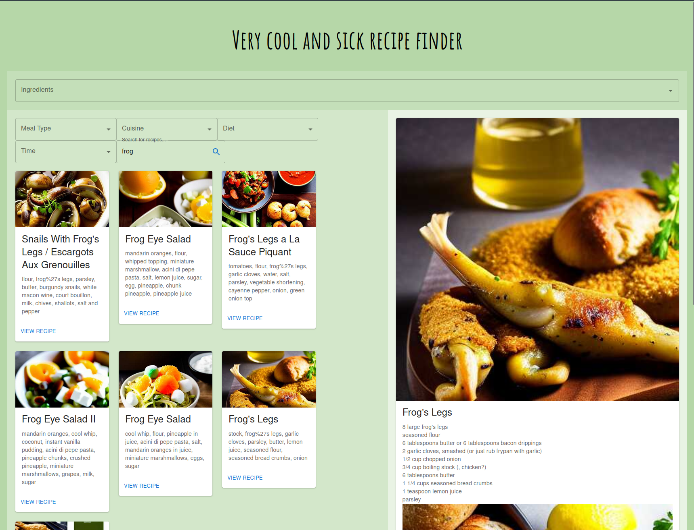
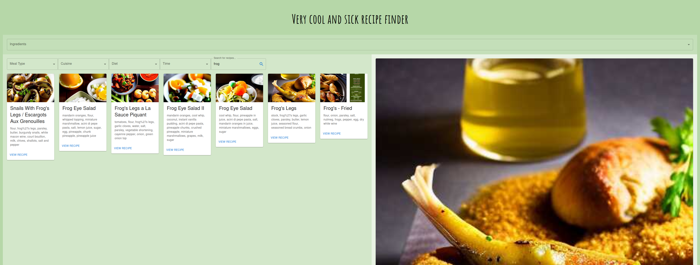
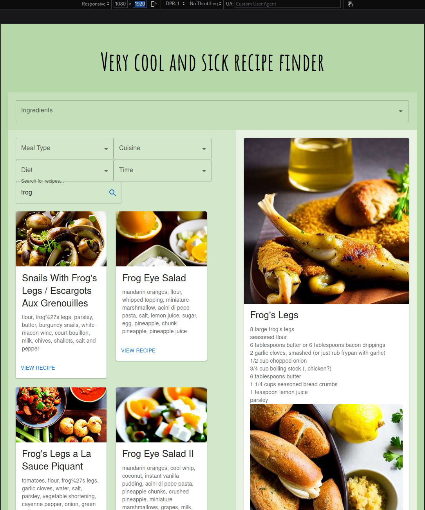

# Frogs

We decided to use stable-diffusion to generate some never-before-seen cute frogs. 

We hope they will bring you joy.

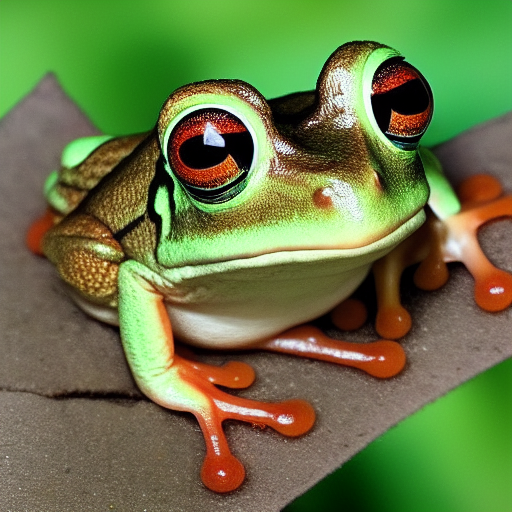
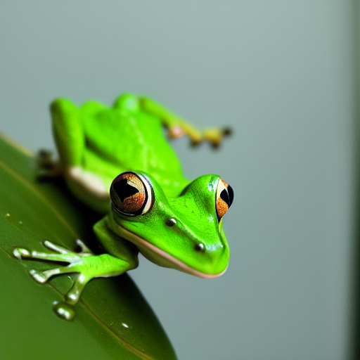
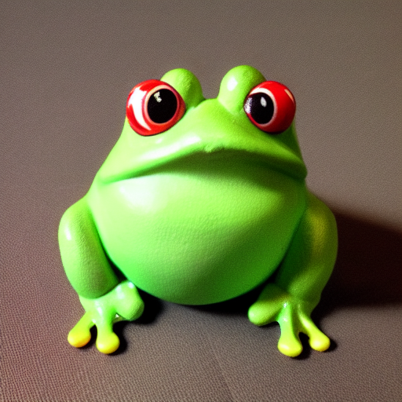
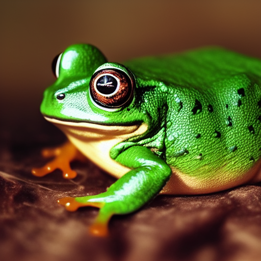
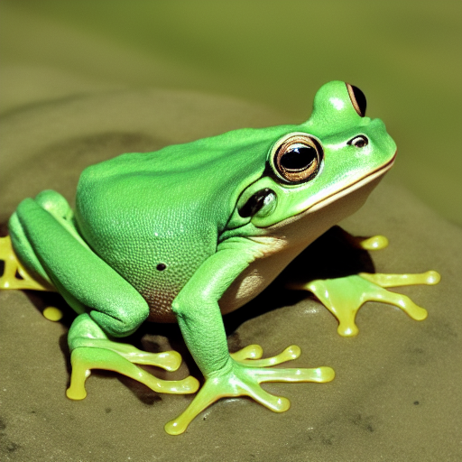
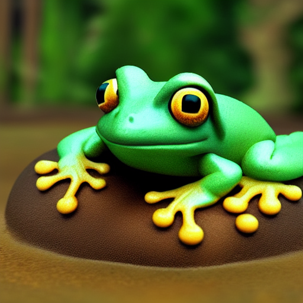
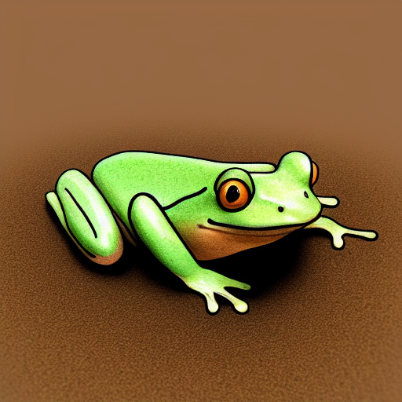
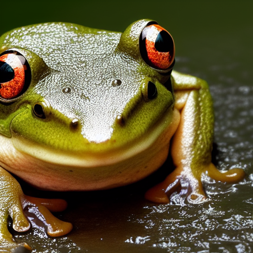
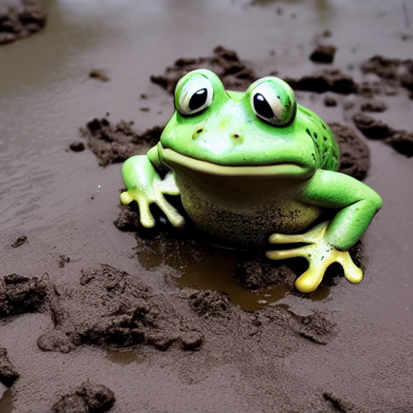
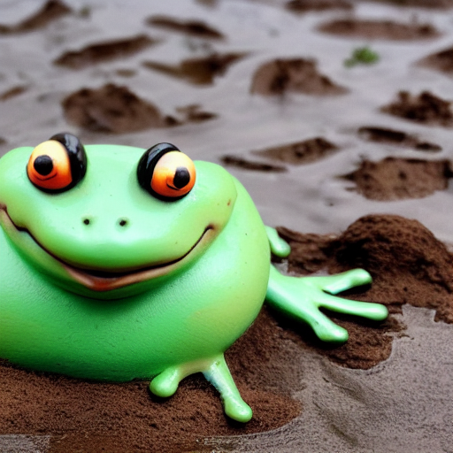
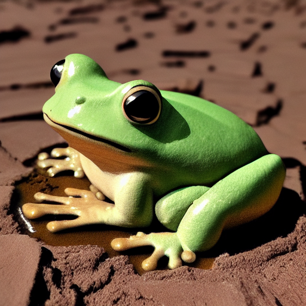
